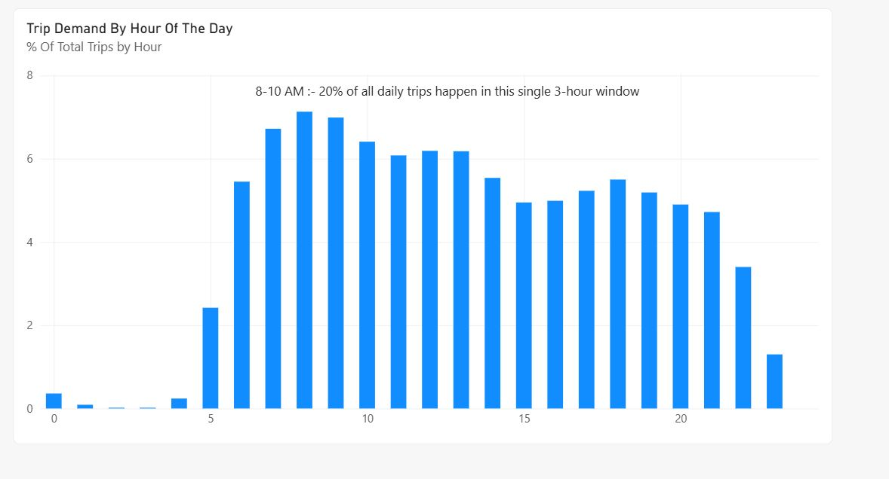
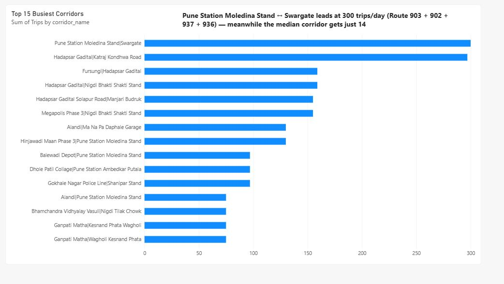
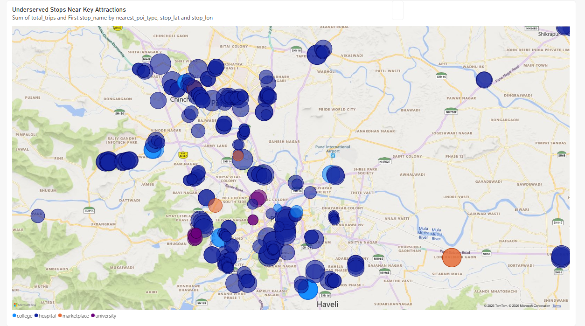
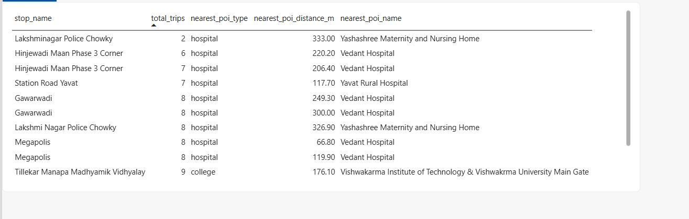

# PMPML Bus Network Analysis

An analysis of Pune's public bus network (PMPML) using officially published GTFS schedule data — examining when service is concentrated, which corridors carry the most trips, and which low-frequency stops sit near high-need public locations.

**Data Source:** PMPML's official GTFS feed, via the [`croyla/pmpml-gtfs`](https://github.com/croyla/pmpml-gtfs) GitHub repository. This reflects PMPML's *published schedule* — not real-time or verified actual operations.

---

## Insights

### 1. Hourly Trip Demand
Service is heavily concentrated around the morning commute — **hours 8–10 AM alone account for ~20.5% of all scheduled trips citywide**, despite being only 3 of the ~19 operating hours. Evening hours (17–19) show a smaller secondary bump (~15.9% combined), suggesting weaker evening commute coverage relative to morning.

### 2. Busiest Corridors
**Pune Station Moledina Stand ↔ Swargate leads at 300 trips/day**, served by two overlapping public route numbers (Route 5 and Route 6, both running bidirectionally) rather than a single line. This sits in sharp contrast to the median corridor, which gets just **14 trips/day** — showing how concentrated service is on a handful of trunk corridors.

### 3. Underserved Stops Near Key Attractions
Bottom 25th percentile stops by daily trip count (≤10 trips/day) were cross-referenced against real Pune points of interest (hospitals, colleges, universities, marketplaces) pulled via the Overpass API.

**273 of 1,822 underserved stops (~15%) sit within 500m of a hospital, college, university, or marketplace** — meaning a meaningful share of Pune's least-served stops are located right next to places with high, consistent foot traffic.

Example: a stop near Sangavi Multispecialist Hospital gets just 2 trips/day despite sitting 7.6m from the hospital gate.

---

## Dashboard

Findings are visualized in Power BI — hourly demand trend, top 15 corridors by trip volume, and a map of underserved stops color-coded by nearby POI type.

---

## Repo Contents

| File | Description |
|---|---|
| `notebook.ipynb` | Full analysis — Insight 1, 2, and 3, with markdown explanations at each step |
| `Hourly_trip_percentage2.csv` | Hourly % of trips citywide (Insight 1 output) |
| `corridor_trips3.csv` | Trip counts per corridor, direction-normalized (Insight 2 output) |
| `underserved_stops_near_attractions.csv` | Underserved stops within 500m of a POI, with nearest POI name/type/distance (Insight 3 output) |
| `stops.txt`, `stop_times.txt`, `trips.txt`, `routes.txt`, `feed_info.txt`, `shapes.csv.txt` | Raw GTFS source files |

---

## Tools Used
- Python (pandas, geopy, requests) in Jupyter
- Overpass API (OpenStreetMap POI data)
- Power BI (dashboard/visualization)

---

## Notes & Limitations
- This analysis reflects PMPML's *published schedule*, not confirmed real-world/actual bus operations.
- Route corridors were normalized by merging directional (UP/DOWN) pairs of the same route into a single bidirectional corridor.
- Some `route_id`s in the trips data had no matching entry in the routes table (orphaned foreign keys) and were excluded from route-name lookups.

